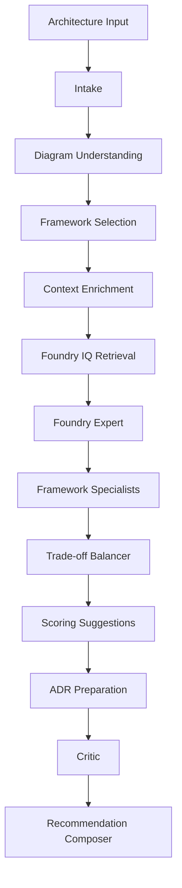

# Agent Orchestration Flow

## Purpose

Describe the current orchestration flow clearly and honestly.

## Current Scope

The current MVP uses application-led orchestration with one cost-aware Azure AI Foundry expert call and local specialist reasoning around grounded context.

## Flow

## Design Decisions

- keep orchestration visible
- do not overstate Azure-hosted agent count
- keep score calculation in application code
- preserve a clean seam for future deeper agent distribution

## Implementation Notes

See [MULTI_AGENT_REASONING.md](MULTI_AGENT_REASONING.md) and [AGENT_CATALOG.md](AGENT_CATALOG.md).

## Future Enhancements

- dedicated Foundry-hosted specialists
- more explicit planner state
- deeper telemetry and evaluation hooks
