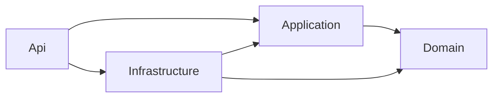

# Clean Architecture Backend

## Purpose

Explain the backend project structure and dependency rules.

## Current Scope

The backend lives under `backend/src/api` and follows Clean Architecture.

## Project Structure

```text
CoArchitect.Api
CoArchitect.Application
CoArchitect.Domain
CoArchitect.Infrastructure
```

## Responsibilities

### CoArchitect.Domain

- entities
- enums
- value-like models
- domain-level contracts expressed through types

### CoArchitect.Application

- use-case services
- orchestration services
- repository interfaces
- scoring and analysis coordination

### CoArchitect.Infrastructure

- TiDB repositories
- storage providers
- Azure AI Foundry integration
- local mock providers
- persistence helpers

### CoArchitect.Api

- controllers
- DTOs
- dependency injection
- Problem Details responses
- runtime configuration

## Dependency Rules



- Domain does not depend on Application, Infrastructure, or Api.
- Application depends on Domain only.
- Infrastructure depends on Application and Domain.
- Api composes the runtime.

## Implementation Notes

The current AI orchestration lives in `CoArchitect.Application`, while concrete providers for TiDB, Azure Blob Storage, and Azure AI Foundry live in `CoArchitect.Infrastructure`.

## Future Enhancements

Future work may add background jobs, richer evaluation pipelines, and deeper telemetry while preserving the same dependency direction.
