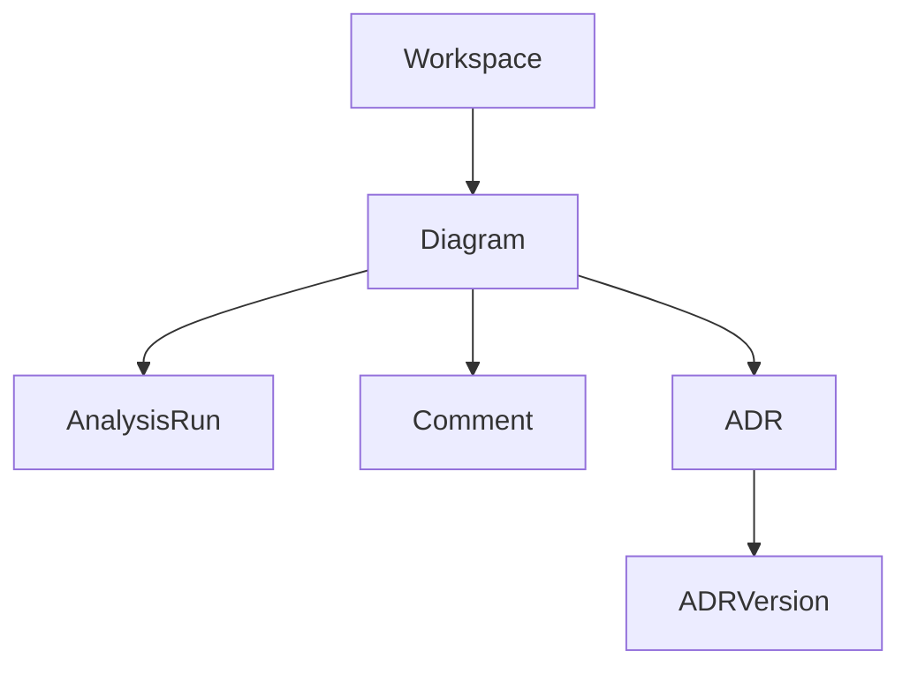

# Data Model

## Purpose

Summarize the product data model used by the MVP.

## Current Scope

The current user-facing model is workspace-centric.

## User-Facing Model

## Current Entities

- Workspace
- ArchitectureDiagram
- DiagramComment
- AgentAnalysisRun
- Adr
- AdrVersion

## Internal Runtime Boundary

Tenant is an internal runtime boundary, not a user-facing object.

The current MVP uses a fixed local tenant and user placeholder for runtime consistency.

## Design Decisions

- workspaces are tenant-owned internally
- diagrams belong to one workspace
- analysis runs persist AI reasoning output snapshots
- ADRs persist decision records and version history

## Implementation Notes

Legacy organization-related tables may remain as compatibility scaffolding, but the active user-facing flow no longer exposes organization as a product object.

## Future Enhancements

- richer finding entities
- explicit review objects
- approval and collaboration records
