# Solution Architecture Diagram

## Purpose

Provide an easy-to-understand architecture diagram for hackathon demos, README content, and judging discussions.

## Scope

This diagram is intentionally honest about the current implementation:

- Azure AI Foundry is the active AI runtime integration path.
- Foundry IQ-style grounding is implemented through a hybrid retrieval layer.
- GitHub Copilot and Codex were used as development copilots.
- Microsoft 365 Copilot is shown as an optional future consumption surface, not a current runtime dependency.

## Comprehensive Diagram

```mermaid
flowchart LR
    %% Users and development copilots
    Evaluator["Evaluator / Architect / Engineer"]
    GHCopilot["GitHub Copilot + Codex\nDevelopment copilots"]
    M365["Microsoft 365 Copilot\nOptional future consumption surface"]

    %% Product experience
    subgraph Product["CoArchitect AI Product"]
        Web["React + TypeScript + Vite Frontend\nWorkspace, diagram review, agent trace, ADR UI"]
        Api[".NET 10 API\nApplication-led orchestration"]

        subgraph Reasoning["Reasoning Pipeline"]
            Intake["Intake"]
            Understanding["Diagram Understanding"]
            Frameworks["Framework Selection"]
            Enrichment["Context Enrichment"]
            Retrieval["Foundry IQ Retrieval"]
            Expert["Azure Foundry Expert Call"]
            Specialists["Local Specialist Reasoning"]
            Tradeoffs["Trade-off Balancer"]
            Scoring["Application Scoring Engine"]
            Adr["ADR Generation"]
            Composer["Recommendation Composer"]
        end

        subgraph Context["Foundry IQ-Style Intelligence Layer"]
            AzureIq["AzureFoundryIqProvider\nManaged retrieval agent"]
            FileIq["FileSystemFoundryIqProvider\nRepo knowledge base fallback"]
            Composite["Composite Context Bundle"]
            Memory["Workspace memory\nPrior findings\nADR history"]
            Knowledge["Framework summaries\nArchitecture principles\nTrade-off guidance\nADR templates"]
        end

        subgraph Data["Persistence and Storage"]
            Tidb["TiDB Cloud\nWorkspaces, analyses, ADR versions"]
            Blob["Azure Blob Storage\nDiagram and file assets"]
        end

        Mock["Mock AI Provider\nLocal/demo fallback"]
    end

    %% Microsoft platform
    subgraph Microsoft["Microsoft Platform"]
        Foundry["Azure AI Foundry Agent Service"]
        FoundryKb["Microsoft Foundry Knowledge Base / Retrieval"]
    end

    %% Interactions
    Evaluator --> Web
    Web --> Api

    Api --> Intake
    Intake --> Understanding
    Understanding --> Frameworks
    Frameworks --> Enrichment
    Enrichment --> Retrieval
    Retrieval --> Expert
    Expert --> Specialists
    Specialists --> Tradeoffs
    Tradeoffs --> Scoring
    Scoring --> Adr
    Adr --> Composer
    Composer --> Web

    Api --> Tidb
    Api --> Blob
    Api --> Mock

    Retrieval --> Composite
    Composite --> Memory
    Composite --> Knowledge
    Composite --> AzureIq
    Composite --> FileIq

    AzureIq --> FoundryKb
    Expert --> Foundry

    Web -. "Findings, score,\nreasoning trace, ADRs" .-> Evaluator
    GHCopilot -. "Used during planning,\nimplementation, refactoring,\ndocumentation, verification" .-> Product
    Composer -. "ADR summaries,\nreview outcomes,\nfuture workflow handoff" .-> M365

    classDef current fill:#e8f3ff,stroke:#2f6fed,stroke-width:1.2px,color:#0f172a;
    classDef platform fill:#eefce8,stroke:#3f8f3f,stroke-width:1.2px,color:#0f172a;
    classDef support fill:#fff7e8,stroke:#c27a00,stroke-width:1.2px,color:#0f172a;
    classDef future fill:#f5f0ff,stroke:#7c4dff,stroke-width:1.2px,color:#0f172a,stroke-dasharray: 4 4;

    class Web,Api,Intake,Understanding,Frameworks,Enrichment,Retrieval,Expert,Specialists,Tradeoffs,Scoring,Adr,Composer,AzureIq,FileIq,Composite,Memory,Knowledge,Tidb,Blob,Mock current;
    class Foundry,FoundryKb platform;
    class GHCopilot support;
    class M365 future;
```

## How To Read It

1. Users interact with the React frontend to upload or select an architecture and review results.
2. The .NET API orchestrates the reasoning flow rather than hiding everything inside one model call.
3. Azure AI Foundry provides the expert reasoning call, while the rest of the pipeline remains visible in application code.
4. The Foundry IQ-style layer grounds recommendations with managed retrieval when available and local knowledge-base fallback when not.
5. TiDB and Azure Blob Storage persist the review workspace, evidence, and ADR outputs.
6. GitHub Copilot and Codex supported delivery of the product itself.
7. Microsoft 365 Copilot can be presented as a future surface for sharing ADRs, summaries, and architecture review outputs.

## Presentation Notes

- Current runtime story: Azure AI Foundry + Foundry IQ-style grounding + visible multi-agent reasoning.
- Current development story: GitHub Copilot and Codex accelerated planning, coding, refactoring, and documentation.
- Honest future extension: Microsoft 365 Copilot can consume ADRs and architecture recommendations, but that is not yet implemented as a live integration.
