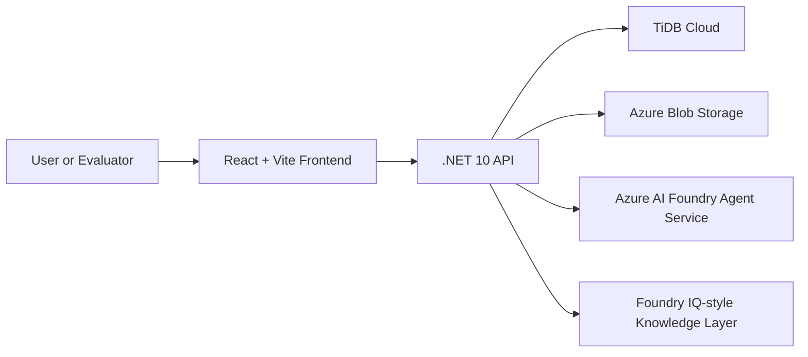

# System Architecture

## Purpose

Describe the current system architecture for CoArchitect AI.

## Current Scope

CoArchitect AI is a monorepo with a .NET 10 backend, a React frontend, TiDB-backed persistence, Azure Blob Storage support, and Azure AI Foundry as the AI integration path.

## Monorepo Overview

## Backend Architecture

- .NET 10
- Clean Architecture
- application-led orchestration
- Problem Details API responses
- TiDB repositories and mock fallbacks

See [CLEAN_ARCHITECTURE_BACKEND.md](CLEAN_ARCHITECTURE_BACKEND.md).

## Frontend Architecture

- React
- TypeScript
- Vite
- React Query
- workspace-centric shell

See [FRONTEND_ARCHITECTURE.md](FRONTEND_ARCHITECTURE.md).

## Persistence

- TiDB Cloud is the primary production-oriented database path
- mock repositories exist only for local mock mode
- analysis runs and ADR versions are persisted

## Storage

- Azure Blob Storage through container SAS for the MVP
- local no-op storage fallback for non-cloud local runs

See [STORAGE_MODEL.md](STORAGE_MODEL.md).

## AI Provider Strategy

- Azure AI Foundry Agent Service is the AI integration path
- one cost-aware Foundry expert call in the current MVP
- local specialist reasoning stages remain in application code
- mock provider supports local reliability without Azure credentials

## Foundry IQ-Style Intelligence Layer

The system includes a Foundry IQ-style intelligence layer built from:

- framework summaries
- architecture principles
- trade-off guidance
- ADR templates
- workspace memory

See [FOUNDRY_IQ_INTELLIGENCE_LAYER.md](../ai/FOUNDRY_IQ_INTELLIGENCE_LAYER.md).

## Local Runtime

- backend default local URL: `http://localhost:5010`
- frontend default local URL: `http://localhost:5173`
- mock AI provider is available by default

## Azure-Backed Local Runtime

The app can run locally against:

- TiDB Cloud
- Azure Blob Storage
- Azure Key Vault as manual secret source
- Azure AI Foundry

See [AZURE_LOCAL_RESOURCES.md](../implementation/AZURE_LOCAL_RESOURCES.md).

## Deployment Direction

The current hackathon build prioritizes local and evaluator-friendly operation. Future deployment may use Azure App Service or Azure Container Apps for the API and a static hosting path for the frontend.

## Future Enhancements

- external identity and RBAC
- Azure AI Search-backed retrieval
- richer evaluation and telemetry
