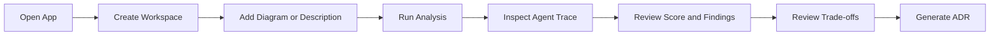

# User Journeys

## Purpose

Describe the hackathon-scoped product journeys.

## Current Scope

These journeys describe what evaluators and users can do in the current MVP.

## Journey 1 — First Architecture Review

```text
Open app
-> Create workspace
-> Add architecture description or diagram
-> Select framework mode
-> Run analysis
-> Watch agents reason
-> Review findings
-> Generate ADR
```

## Journey 2 — Improve Architecture From Findings

```text
Open analysis result
-> Inspect missing capabilities
-> Compare trade-offs
-> Review grounded recommendations
-> Generate ADR
```

## Journey 3 — Architecture Decision Record

```text
Open diagram
-> Generate ADR from review
-> Review HTML preview
-> Save ADR version
-> Export PDF if available
```

## Journey 4 — Evaluator Demo Flow

Use the synthetic B2B SaaS architecture:

```text
Open app
-> Create workspace
-> Add synthetic architecture description
-> Select Auto Detect
-> Run analysis
-> Show Foundry IQ context
-> Show agent trace
-> Show score and findings
-> Show trade-offs
-> Generate ADR
```

## 5-Minute Journey Map



## Future Enhancements

- collaboration and assignment workflows
- richer review comparison views
- deeper ADR export and approval flows
