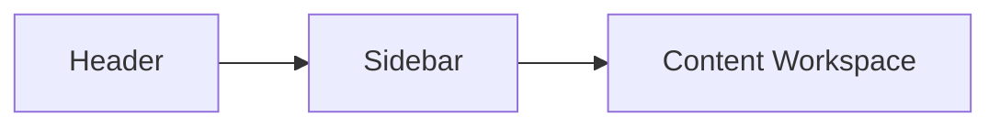

# UI Layout Plan

## Purpose

Summarize the intended layout model for the MVP.

## Current Scope

The current plan is already reflected in the shell and working surfaces.

## Layout Model

## Design Decisions

- compact header
- persistent left panel
- content-first analysis surfaces
- minimal card usage
- stronger separation between navigation and content

## Future Enhancements

- more responsive adaptation for smaller screens
- richer split-view comparison layouts
